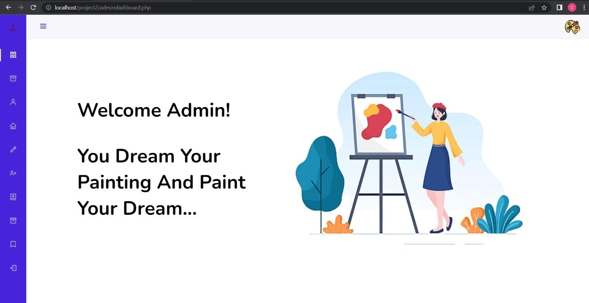
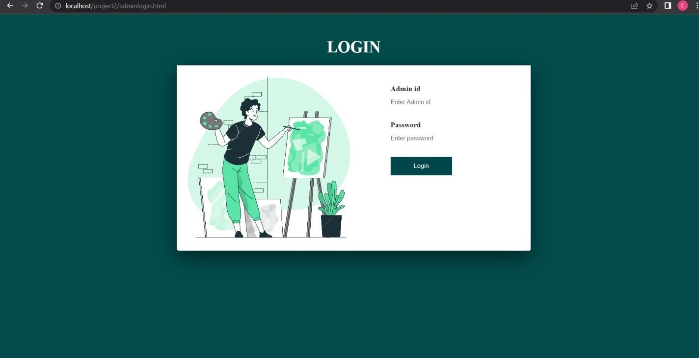
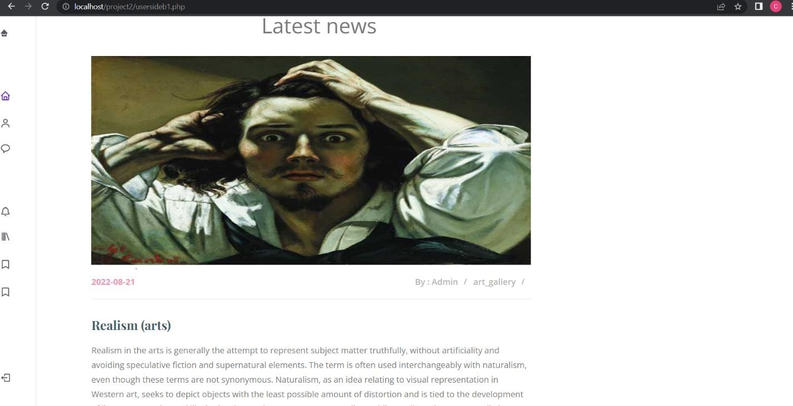
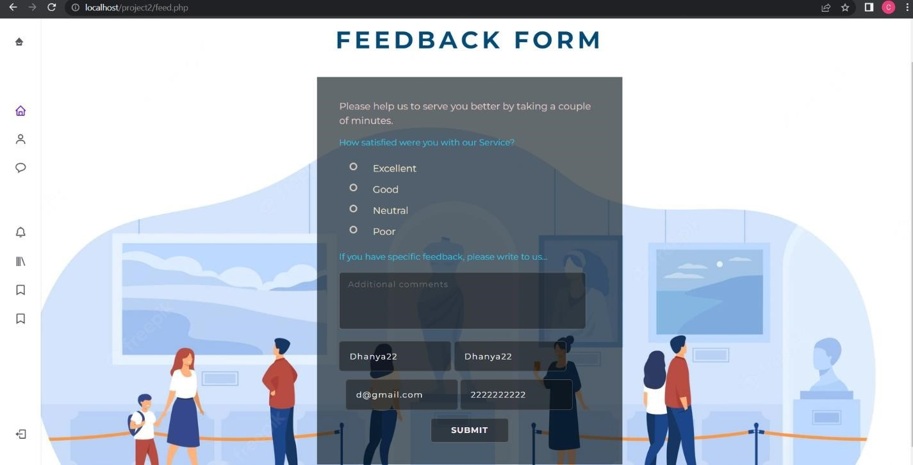
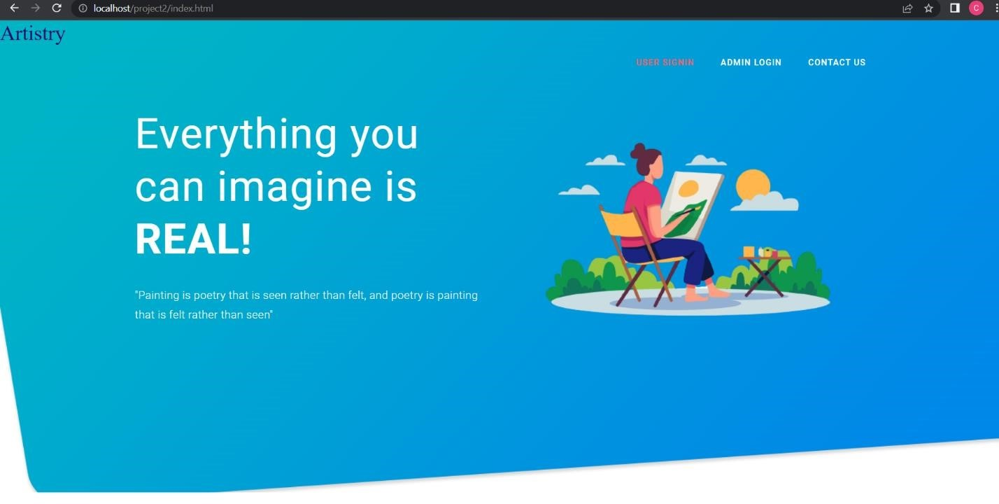
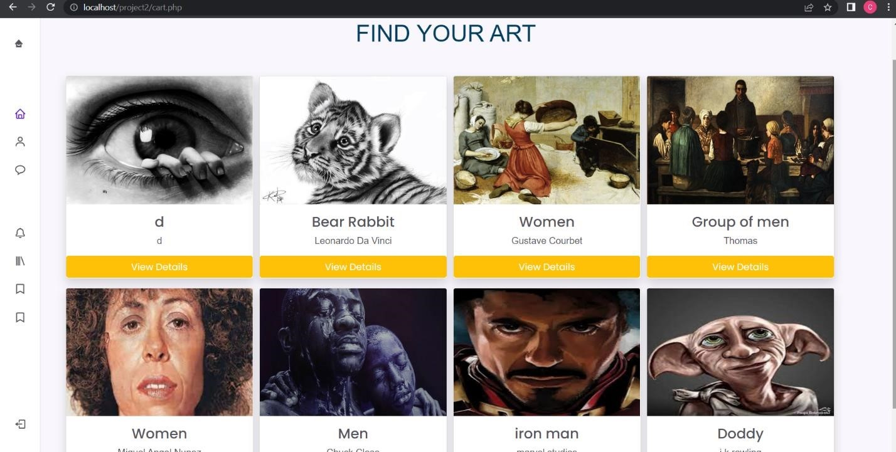
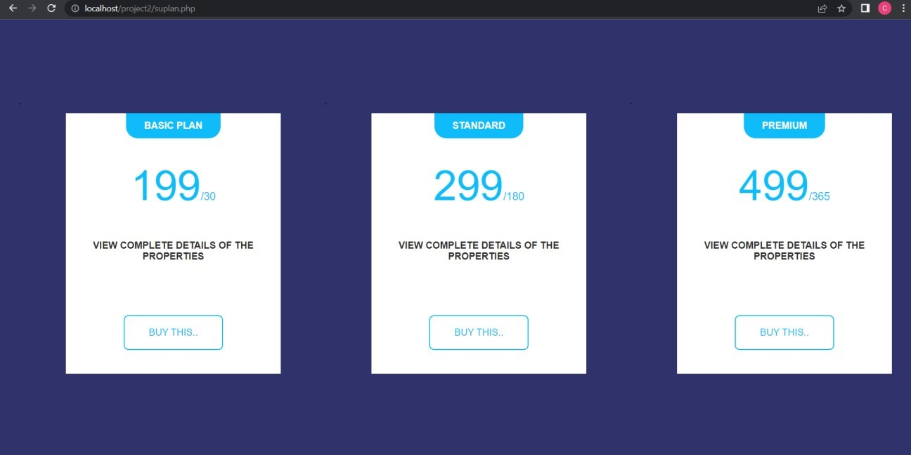
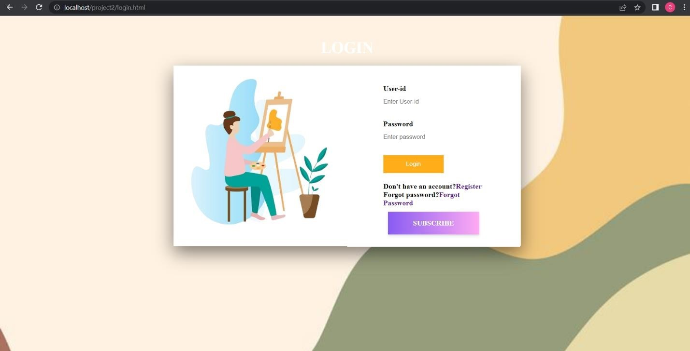

# git@github.com:DhanyaM2001/ART-GALLERY-MANAGEMENT-SYSTEM.git

# Art Gallery Management System
>Utilising HTML,CSS, JS, PHP, MYSQL functionalities and backend is implemented.
>ART GALLERY is a software programme that is highly beneficial for art enthusiasts and people who wish to learn more about work and upload their own art.
The end-users may use this application to look for their artwork and place orders.

for the chosen works. Additionally, the end user may obtain details about the artwork and its associated cost in order to get in touch with the vendor.
You now have the chance to see online art exhibitions at our Art Gallery. The Online Art Gallery is updated every day, allowing users to browse and purchase the most recent online collection of modern art from any location in the globe.

>AGMS provides a centralized management by storing it in a database System where the data is managed by the database management system.
## Features

- Admin/seller can add the product by giving the product details. 
- If the user is intrested on a particular art work ,they can click on intrested button so that their intrest on the property is recorded.

- If the user is intrested on particular property and to know more details about the property,the buyer needs to subscribe for the plan's given in the website.
- Once the user subscribe for the plan,the subscribe user will be able to see the full details of the product like seller's name,cost and size of the product,artist details etc.

- Google re-Capcha api is used and it is mandatory while registering to our website.

- Razor pay api is used for test mode payment.
- Validation of all forms using JS
## Language Used

PHP,HTML,CSS,Java Script,Bootstrap. 

## Screenshots
>Admin Home page

>Admin login

>Blog

>Feedback

>Welcome page

>Product list

>Subscription

>User login

## Installation

Download latest version of xampp server.

## Run Locally

- Step-1 : Go to C drive -> xampp -> htdocs -> create project2 folder ->place all the downloaded files and folder.  
- Step-2 : import .sql file in xammp.
- Step-3 : Go to browser type:localhost/project2/index.html.
- Step-4 : Please remember to replace your own razorpay credentials to see all the transcations in your own razorpay account(demo version)
  >You can add your own keys in config.php file(Get the keys from official razorpay website),
  >You can add your name,email,number in pay.php file

NOTE:
Step-4 is OPTIONAL only if you want to implement demo subscription in your project follow this...
This Payment will basically allows the user to see full details of product...initally all users have free subscription for 15 days(Check db as soon as you register a new user) after free subscription they can see only partial details, To update this they pay(for full details).

If you want to make any changes in any page just see the url to know the file name

Hope this helps...any doubts please leave a comment below...!
HAPPY CODING;)
